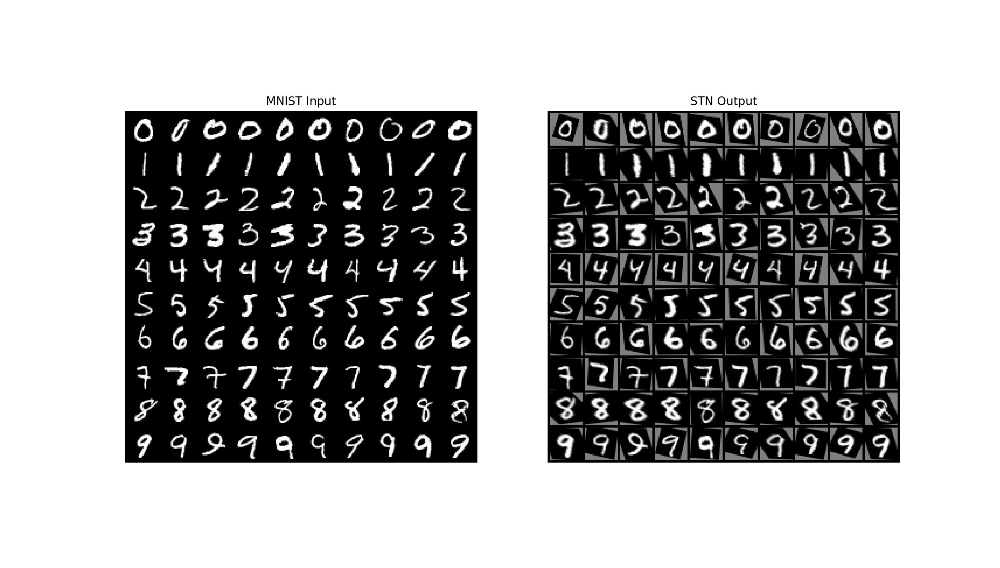

# STN

### Title
[Spatial Transform Networks](https://arxiv.org/abs/1506.02025)

### Abstract
Convolutional Neural Networks define an exceptionally powerful class of models, but are still limited by the lack of ability to be spatially invariant to the input data in a computationally and parameter efficient manner. In this work we introduce a new learnable module, the Spatial Transformer, which explicitly allows the spatial manipulation of data within the network. This differentiable module can be inserted into existing convolutional architectures, giving neural networks the ability to actively spatially transform feature maps, conditional on the feature map itself, without any extra training supervision or modification to the optimisation process. We show that the use of spatial transformers results in models which learn invariance to translation, scale, rotation and more generic warping, resulting in state-of-the-art performance on several benchmarks, and for a number of classes of transformations.
        
## Train
    $ python main.py --mode train \
                     --scope [scope name] \
                     --name_data [data name] \
                     --dir_data [data directory] \
                     --dir_log [log directory] \
                     --dir_checkpoint [checkpoint directory]
---
    $ python main.py --mode train \
                     --scope stn \
                     --name_data mnist \
                     --dir_data ./datasets \
                     --dir_log ./log \
                     --dir_checkpoint ./checkpoint
* If **--scope** is defined as "stn", **a classification network with STN** is used.
---
    $ python main.py --mode train \
                     --scope cls \
                     --name_data mnist \
                     --dir_data ./datasets \
                     --dir_log ./log \
                     --dir_checkpoint ./checkpoint
 * If **--scope** is defined as "cls", **a classification network without STN** is used.
 
 ---
* Set **[scope name]** uniquely.
* To understand hierarchy of directories based on their arguments, see **directories structure** below. 
* Hyperparameters were written to **arg.txt** under the **[log directory]**.

## Test
    $ python main.py --mode test \
                     --scope [scope name] \
                     --name_data [data name] \
                     --dir_data [data directory] \
                     --dir_log [log directory] \
                     --dir_checkpoint [checkpoint directory] \
                     --dir_result [result directory]
---
    $ python main.py --mode test \
                     --scope stn \
                     --name_data mnist \
                     --dir_data ./datasets \
                     --dir_log ./log \
                     --dir_checkpoint ./checkpoints \
                     --dir_result ./results
---
    $ python main.py --mode test \
                     --scope cls \
                     --name_data mnist \
                     --dir_data ./datasets \
                     --dir_log ./log \
                     --dir_checkpoint ./checkpoints \
                     --dir_result ./results

* To test using trained network, set **[scope name]** defined in the **train** phase.
* Generated images are saved in the **images** subfolder along with **[result directory]** folder.
* **index.html** is also generated to display the generated images.  

## Tensorboard
    $ tensorboard --logdir [log directory]/[scope name]/[data name] \
                  --port [(optional) 4 digit port number]
---
    $ tensorboard --logdir ./log/dcgan/celeba \
                  --port 6006
                  
After the above comment executes, go **http://localhost:6006**

* You can change **[(optional) 4 digit port number]**.
* Default 4 digit port number is **6006**.

## Results

* The results were generated by a network trained with **mnist** dataset during **10 epochs**.
* After finishing the Test phase, execute **display_result.py** to display the figure.
* Left figure shows MNIST Input and right figure shows STN output.

* Below table shows quantitative metrics such as cross entropy loss and accuracy. 

|        Metrics     | w/o STN   | w/ STN      |
|:------------------:|:---------:|:-----------:|
| Cross Entropy Loss | 0.0457    | **0.0350**  |
| Accuracy (%)       | 98.5868   | **98.8654** |

## Directories structure
    pytorch-STN
    +---[dir_checkpoint]
    |   \---[scope]
    |       \---[name_data]
    |           +---model_epoch00000.pth
    |           |   ...
    |           \---model_epoch12345.pth
    +---[dir_log]
    |   \---[scope]
    |       \---[name_data]
    |           +---arg.txt
    |           \---events.out.tfevents
    \---[dir_result]
        \---[scope]
            \---[name_data]
                +---images
                |   +---00000-output.png
                |   |   ...
                |   +---12345-output.png
                \---index.html

---

    pytorch-STN
    +---checkpoints
    |   \---stn
    |       \---mnist
    |           +---model_epoch00001.pth
    |           |   ...
    |           \---model_epoch0010.pth
    +---log
    |   \---cls
    |   |   \---mnist
    |   |       +---arg.txt
    |   |       \---events.out.tfevents
    |   \---stn
    |       \---mnist
    |           +---arg.txt
    |           \---events.out.tfevents
    \---results
        \---cls
        |   \---mnist
        |       +---images
        |       |   +---00000-output.png
        |       |   |   ...
        |       |   +---09999-output.png
        |       \---index.html
        \---stn
            \---mnist
                +---images
                |   +---00000-output.png
                |   |   ...
                |   +---09999-output.png
                \---index.html
 
* Above directory is created by setting arguments when **main.py** is executed.               
        